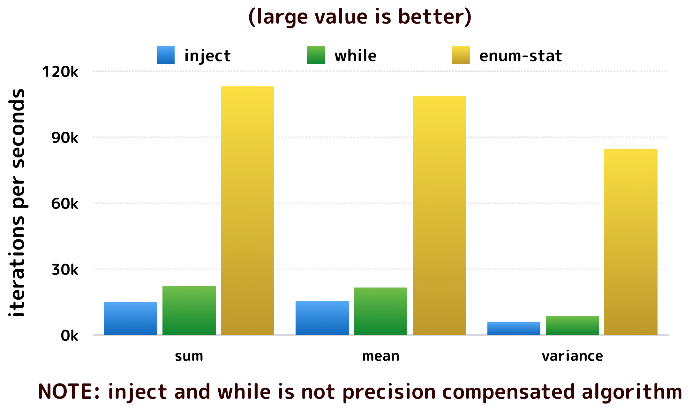

# Enumerable::Statistics

[](https://travis-ci.org/mrkn/enumerable-statistics)

Enumerable::Statistics provides some methods to calculate statistical summary in arrays and enumerables.

## Installation

Add this line to your application's Gemfile:

```ruby
gem 'enumerable-statistics'
```

And then execute:

    $ bundle

Or install it yourself as:

    $ gem install enumerable-statistics

## Usage

You should load this library by the following line in your script at first.

```ruby
require 'enumerable/statistics'
```

The following methods are supplied by this library:

- `Array#mean`, `Enumerable#mean`
  - Calculates a mean of values in an array or an enumerable
- `Array#variance`, `Enumerable#variance`
  - Calculates a variance of values in an array or an enumerable
- `Array#stdev`, `Enumerable#stdev`
  - Calculates a standard deviation of values in an array or an enumerable
- `Array#mean_variance`, `Enumerable#mean_variance`
  - Calculates a mean and a variance simultaneously
- `Array#mean_stdev`, `Enumerable#mean_stdev`
  - Calculates a mean and a standard deviation simultaneously
- `Array#median`
  - Calculates a median of values in an array
- `Array#percentile(q)`
  - Calculates a percentile or percentiles of values in an array
- `Array#value_counts`, `Enumerable#value_counts`, and `Hash#value_counts`
  - Count how many items for each value in the container

Moreover, for Ruby < 2.4, `Array#sum` and `Enumerable#sum` are provided.

All methods scan a collection once to calculate statistics and preserve precision as possible.

## Performance

```
$ bundle exec rake bench
# sum
Warming up --------------------------------------
              inject     1.545k i/100ms
               while     2.342k i/100ms
                 sum    11.009k i/100ms
Calculating -------------------------------------
              inject     15.016k (± 9.6%) i/s -     75.705k in   5.098723s
               while     22.238k (±16.2%) i/s -    107.732k in   5.068156s
                 sum    112.992k (± 6.9%) i/s -    572.468k in   5.091868s
# mean
Warming up --------------------------------------
              inject     1.578k i/100ms
               while     2.057k i/100ms
                mean     9.855k i/100ms
Calculating -------------------------------------
              inject     15.347k (± 8.6%) i/s -     77.322k in   5.076009s
               while     21.669k (±14.5%) i/s -    106.964k in   5.074312s
                mean    108.861k (± 8.9%) i/s -    542.025k in   5.021786s
# variance
Warming up --------------------------------------
              inject   586.000  i/100ms
               while   826.000  i/100ms
            variance     8.475k i/100ms
Calculating -------------------------------------
              inject      6.187k (± 6.7%) i/s -     31.058k in   5.043418s
               while      8.597k (± 7.4%) i/s -     42.952k in   5.024587s
            variance     84.702k (± 8.5%) i/s -    423.750k in   5.039936s
```



## Development

After checking out the repo, run `bin/setup` to install dependencies. You can also run `bin/console` for an interactive prompt that will allow you to experiment.

To install this gem onto your local machine, run `bundle exec rake install`. To release a new version, update the version number in `version.rb`, and then run `bundle exec rake release`, which will create a git tag for the version, push git commits and tags, and push the `.gem` file to [rubygems.org](https://rubygems.org).

## Contributing

Bug reports and pull requests are welcome on GitHub at https://github.com/mrkn/enumerable-statistics.

